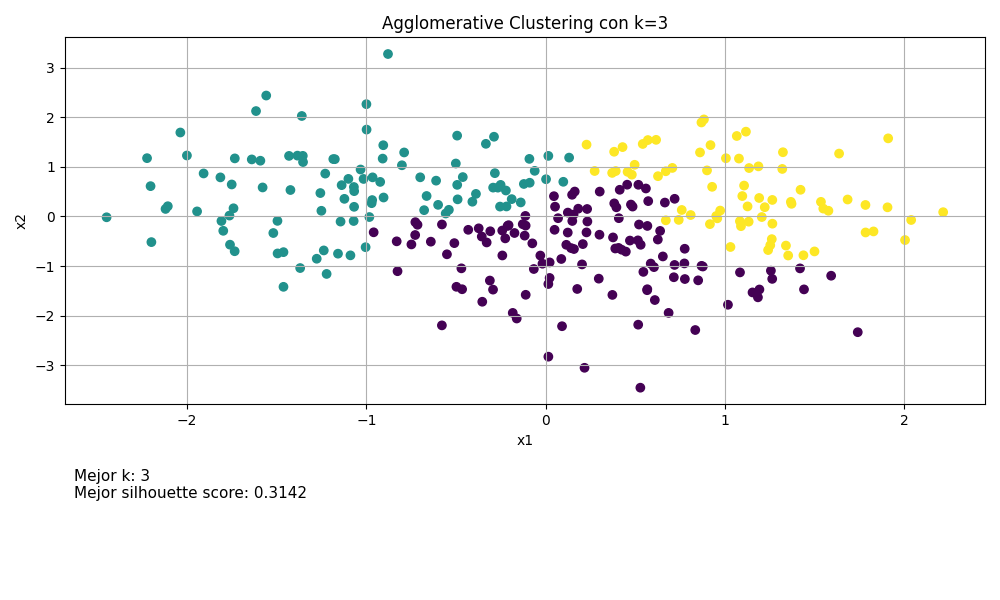
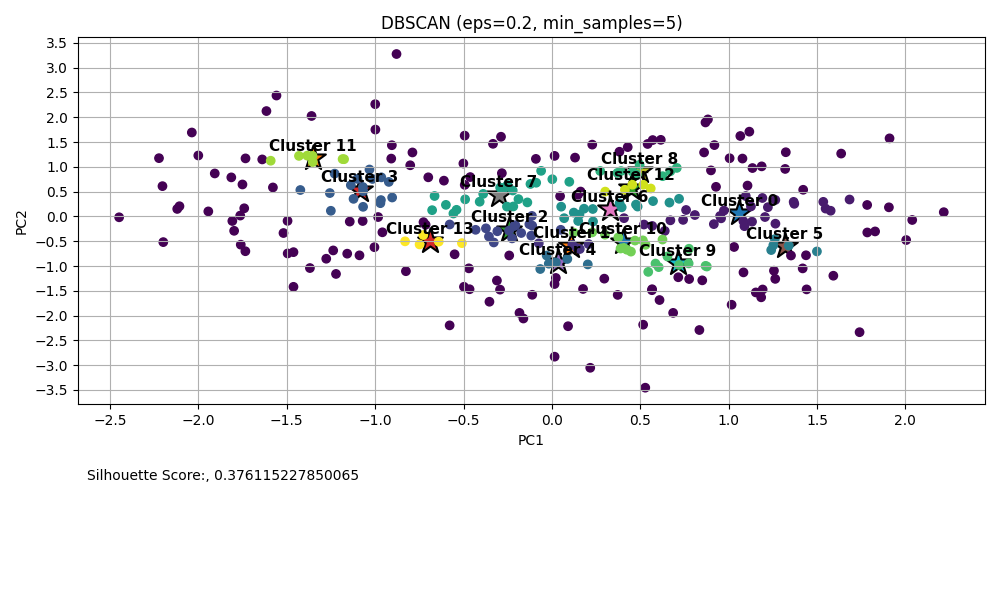
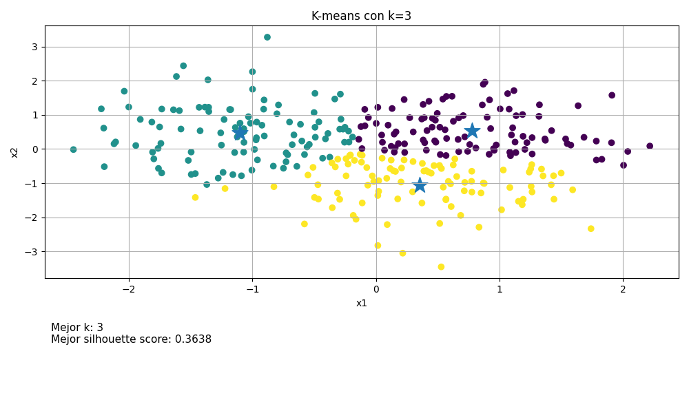

# Clustering Algorithm Comparison Tool

A Python script that implements and compares three classic clustering algorithms on a synthetic dataset — with visualizations and silhouette score evaluation for each method.

Built as a hands-on exploration of unsupervised learning techniques.

---

## Visualization
<p align="center">
  
</p>

<p align = "center">
  Agglomerative method output
</p>

<p align="center">
  
</p>

<p align = "center">
  DBScan method output
</p>

<p align="center">
  
</p>

<p align = "center">
  K-means method output
</p>


## Algorithms Included

| Algorithm | Best For |
|---|---|
| **DBSCAN** | Arbitrary-shaped clusters, handles noise/outliers |
| **K-Means** | Compact spherical clusters, auto-selects best *k* |
| **Agglomerative Clustering** | Hierarchical structure, no distance assumptions |

---

## Features

- **Synthetic dataset** generated with `make_blobs` (300 samples, 3 centers) and normalized with `StandardScaler`
- **Interactive menu** — choose which algorithm to run at runtime
- **Silhouette Score** evaluation for all three methods
- **K-Means auto-tuning** — tries *k* from 2 to 10 and picks the best score automatically
- **2-panel visualizations** for each algorithm:
  - Scatter plot with color-coded clusters and labeled centroids (★)
  - Metrics summary panel below the plot

---

## Requirements

Python 3.x and the following libraries:

```bash
pip install scikit-learn pandas matplotlib numpy
```

---

## Usage

1. Clone the repository:
   ```bash
   git clone https://github.com/pinkie3141592/<repo-name>.git
   cd <repo-name>
   ```

2. Run the script:
   ```bash
   python main.py
   ```

3. Choose an algorithm from the menu:
   ```
   1. DBSCAN
   2. K-means
   3. Agglomerative
   ```

---

## Algorithm Details

### 1. DBSCAN
Groups points based on density. Points in low-density regions are labeled as **noise** (`-1`) and excluded from scoring. Parameters used:
- `eps = 0.2`
- `min_samples = 5`

### 2. K-Means
Iterates over *k* values from 2 to 10, selects the one with the highest Silhouette Score, and reruns the final clustering with the optimal *k*.

### 3. Agglomerative Clustering
Hierarchical bottom-up clustering with a fixed `k = 3`, matching the number of centers in the generated dataset.

---

## Notes

- The dataset is regenerated fresh each run using a fixed `random_state=123` for reproducibility.
- DBSCAN's `eps` and `min_samples` can be tuned directly in the `dbscannn()` function for different datasets.
- Silhouette Score ranges from -1 to 1 — the closer to 1, the better-defined the clusters.
